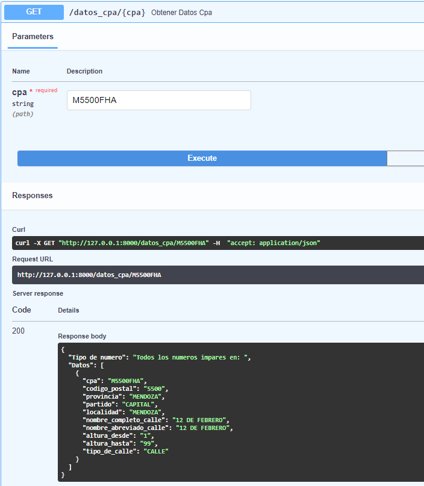
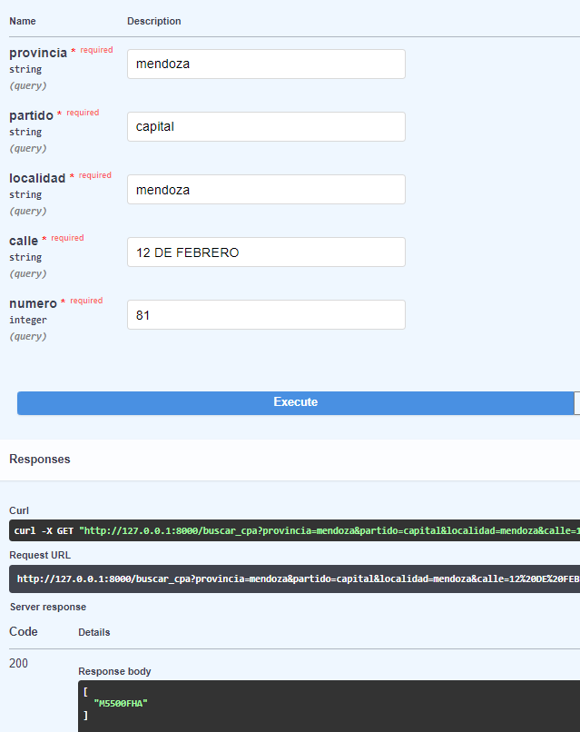

# Challenge Código Postal Argentino

## Mi solucion

Buscando una fuente de datos alternativa encontre datasets que corresponden al codigo postal argentino:
[Fuente](http://datar.info/en/dataset/codigo-postal-argentino)

Los datasets estan en formato de sqlite y en csv. En mi caso trabaje con los archivos csv y la libreria pandas.

Lo que hice fue unir los csv en el archivo [Preparacion_datos.ipynb](Preparacion_datos.ipynb), realizar una limpieza y normalizacion, y luego guarde el dataframe unico como un nuevo csv.

A continuacion hice una api usando FastApi. La api contiene dos endpoints:

* El primer endpoint permite introducir un cpa y devuelve toda la informacion relacionada.
  
* El segundo endpoint requiere introducir una provincia, partido, localidad, calle y numero y devuelve el cpa correspondiente
  

## Conclusion

Si bien la solucion probablemente no sea la esperada para el challenge, en donde se pedia un metodo para hacer scraping de los datos de los cpa, esta solucion usando una fuente alternativa permite acceder a estos datos facilmente.
 A su vez tambien inclui el codigo para la api porque no queria entregar solo un notebook donde cargaba y unia los archivos csv. Por otro lado esto fue hecho de forma rapida en un dia, por lo que puede haber detalles para mejorar. Por ejemplo se podrian usar las tablas de sqlite o se podria subir todo a una base de datos para su consulta.
 De todas formas espero que la solucion sirva para al menos acceder a la informacion necesaria de los cpa, la cual deberia ser publica y se deberia poder acceder mas facilmente a esta informacion.

### Contacto

Mail: lautaro_166@hotmail.com

Linkedin: [https://www.linkedin.com/in/lautaro-pierotti/](https://www.linkedin.com/in/lautaro-pierotti/)
