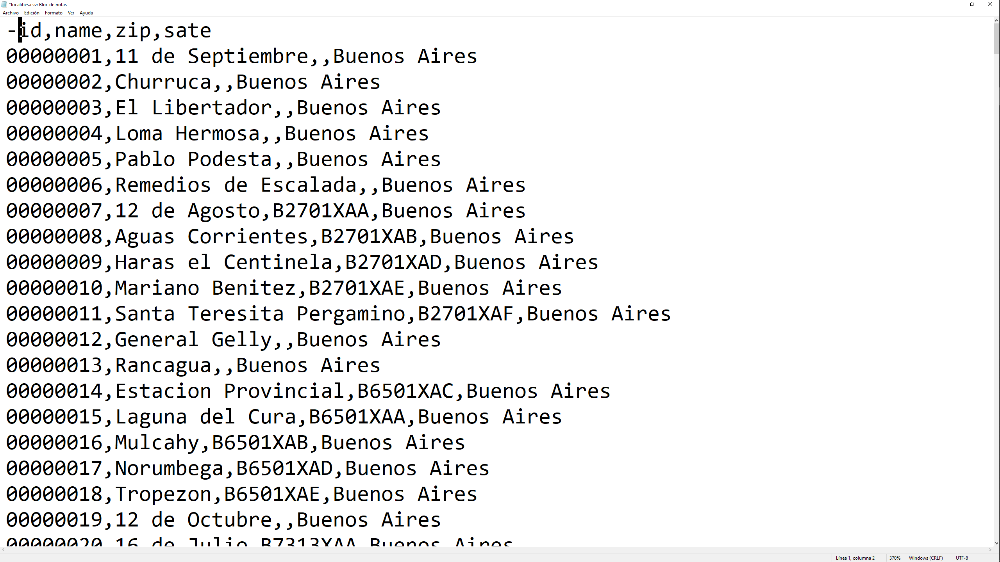
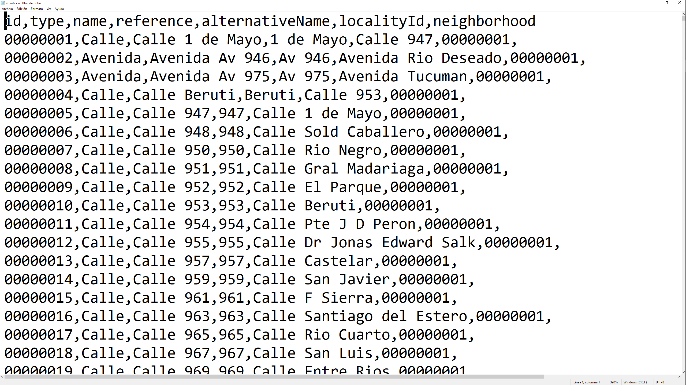
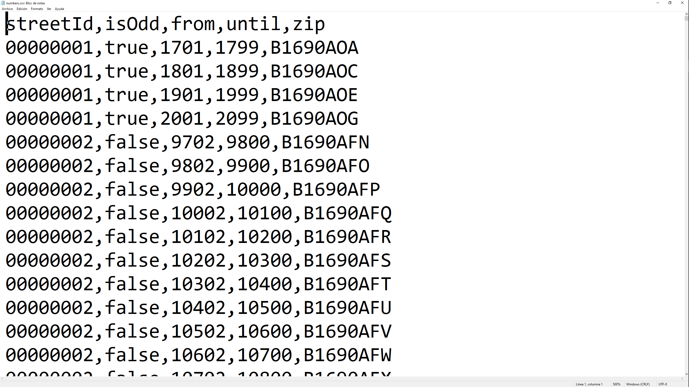

# Obtención de CPAs
### (Código postal argentino)

## Objetivo del proyecto

Desarrollar un algorítmo que sea capáz de obtener todos los para cada localidad de la República Argentina, para cada calle, por alturas diferentes y por veredas pares e impares si los hubiera.

## Enfoque adoptado

Dado que los CPAs poseen una gran cantidad de convinaciones dada su estructura (A1234AAA), donde la primer letra identifica a la
provincia, los 4 número siguientes son el código postal de las localidades y las últimas tres letras corresponden a un código
único que puede ser para toda una localidad pequeña o rural sin calles numeradas con distintas alturas, puede ser para toda
una calle en toda su extención tanto números pares como impares o puede ser para un determinado rango de alturas y pudiendo ser vereda par o impar.
Dada la gran cantidad de convinaciones opté por utilizar la página propuesta en el desafío para obtener los CPAs, accediendo directamente a las URLs que en dicha página se pueden obtener mediante el uso de la técnica de web scraping.
La ventaja que a mi entender tiene este enfoque es que proporciona los enlaces (URL) a las localidades y calles existentes en la página web, evitando el iterar letra a letra los códigos y obtener respuestas vacías por códigos inexistentes; haciendo al algorítmo lento e ineficiente y dificultando la tarea de saber cuántas páginas vacías sucesivas son necesarias para cambiar al próximo nivel de letra en el código. Actualmente las localidades que no cuentan con calles con alturas, como zonas rurales, poseen un único código para la zona, el cual, actualmente, comienza con la letra "X" en el código final de tres letras; aunque eso podría cambiar a futuro, así que no se podría tomar como regla.
Al utilizar las URL que la página proporciona nos aseguramos que hacemos una consulta a una página que sí trerá datos útiles.
Otra ventaja es que al consultar una localidad cualquiera, si las hay,  nos trae también las localidades que comparten el mismo código postal numérico, así que en una sola consulta, obtenemos varios CPA o el enlace a las distintas calles de cada localidad.

## Recursos utilizados

- Python como lenguaje para desarrollar la solución.

- Requests para obtener las páginas web mediante la consulta a través de las URLs.

- Beautiful Soup para parsear el HTML y obtener los datos de las distintas etiquetas HTML.

- 're' para verificar la estructura del CPA mediante el uso de expresiones regulares.

## Descripción del algorítmo

- Comenzamos por consultar la página para Argentina y obtener todas las provincias que la componen, en una sola consulta la página nos devuelve las 24 provincias y obtenemos el nombre y la URL de la misma, esta última nos permitirá obtener las localidades que la componen.

- Obtenemos los localidades de cada provincia según la URL del paso anterior y a su vez obtenemoslas URLs de cada localidad. Este proceso está envuelto en un bucle que nos asegura obtener los datos, dado que pese a esperar entre consultas al servidor, este suele cortar la conexión, seguramente por el tráfico detectado.

- Creamos los archivos 'csv' en donde guardaremos las localidades, las calles y los números con sus correspondientes características.

- Iteramos cada provincia y dentro de esta iteramos cada localidad. Al recibir la página correspondiente a una localidad se pueden dar 2 casos, que haya más regiones que comparten el mismo código postal numérico que la localidad visitada o que haya solo esa localidad con el correspondiente enlace a sus calles.

En este último caso visitamos el enlace y procesamos las calles lo cual se describirá más adelante.

En el caso de que haya más localidades compartiendo el mismo código postal numérico, guardamos los enlaces a sus calles o su CPA si es una localidad que no posee calles con distintos CPA. Para detectar si encontramos el CPA o un enlace a sus calles usamos expresiones regulares para detectar el CPA.
Si hay calles asociadas nos quedamos con los enlaces para procesarlas.

- Mediante el link de las calles de cada localidad accedemos a las mismas creando una estructura de diccionario de python para almacenar toda la información. Obtenemos el nombre de la calle, su tipo y referencia. Luego accedemos al enlace de la calle para obtener los distintos CPAs por alturas y veredas o el único CPA para toda la calle según los datos que recibimos en la consulta web.
Los CPAs poseen un enlace que nos permite obtener el nombre alternativo de la calle si lo tuviera.

- Todos los bloques de código que obtienen datos de las URLs se encuentran dentro de un bucle con una condición de seguridad de obtención de los datos esperados para evitar que al cortarse la conexión por cualquier motivo se suspenda el proceso de obtención de datos.

- Luego guardamos los datos de la localidad, las localidades que comparten el mismo código postal numérico, si las hay, al igual que todos los datos de cada calle; es en este momento cuando se asigna el número de ID tanto a la localidad como a las calles, lo cual nos asegura que todos los datos los tenemos disponibles para ser guardados y no se producirá una interrupción en la obtención de los datos que nos obligue a rastrear el último ID asignado.
Los nombres de las localidades guardadas en el archivo csv son agregadas a una lista de localidades ya procesadas, esto es dado que al acceder al enlace de una localidad puede haber más localidades que comparten el mismo código postal numérico, las cuales también procesamos dado que la URL de la localidad original nos da los datos de las demás localidades y así aprovechamos en una única consulta web a obtener varios datos, pero debemos guardar los nombres de las localidades ya procesadas para no procesarlas nuevamente cuando las encontremos en la iteración que hacemos a lo largo de las localidades de la provincia en la cual estamos trabajando.

## Resultados obtenidos

### Capturas de los archivos csv

Localities.csv

Streets.csv

Numbers.csv

