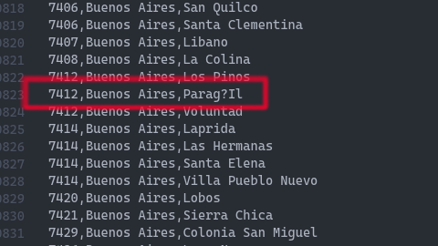
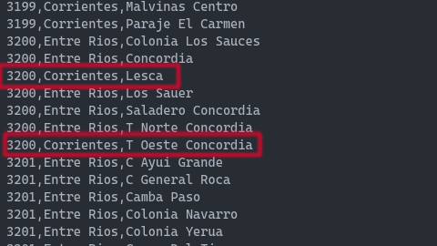

# Solucion Challenge CPA por Luciano Piñol

Hola! Esta es mi solucion para obtener todos los CPA. Quiero aclarar que decidi escribir un nuevo archivo `localidades.csv`, dentro de `/src/data`, ya que he encontrado algunas fallas en el archivo original `localities`, buscando aleatoriamente y pensé que seria mejor reescribirlo, para asegurarme la veracidad de los datos.

Ejemplos de fallas encontradas:

### Falla 1 encontrada:

Error ortográfico, en lugar de la u con diéresis `ü` encontramos el signo `?`

### Falla 2 encontrada:

Las localidades `Lesca` y `Tablada Oeste` se encuentra dentro de Entre Ríos y no de Corrientes.

## Correr el archivo principal

Con el comando `pnpm start`, corre el programa de consola interactivo.. dentro de las cuales tenemos 3 opciones para elegir:

-   Opcion 1: Crear (si no existen) y popular los archivos `.csv` donde estara toda la informacion, aqui empezara el proceso de scraping de toda la web de `codigo-postal.co`.

-   Opcion 2: Consultar el `CPA` dando como informacion: Provincia, Localidad, Calle y altura.

-   Opcion 3: Consultar a que provincia, localidad, calle y altura (si corresponde) pertenece el `CPA` proporcionado.
